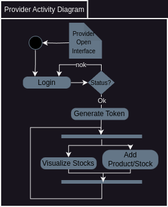
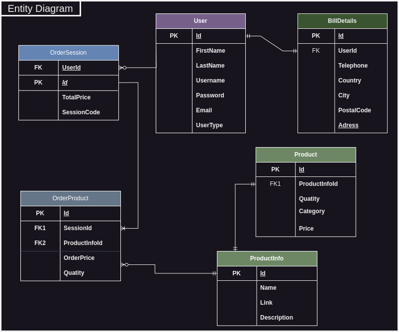
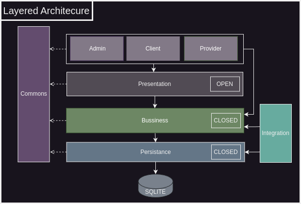
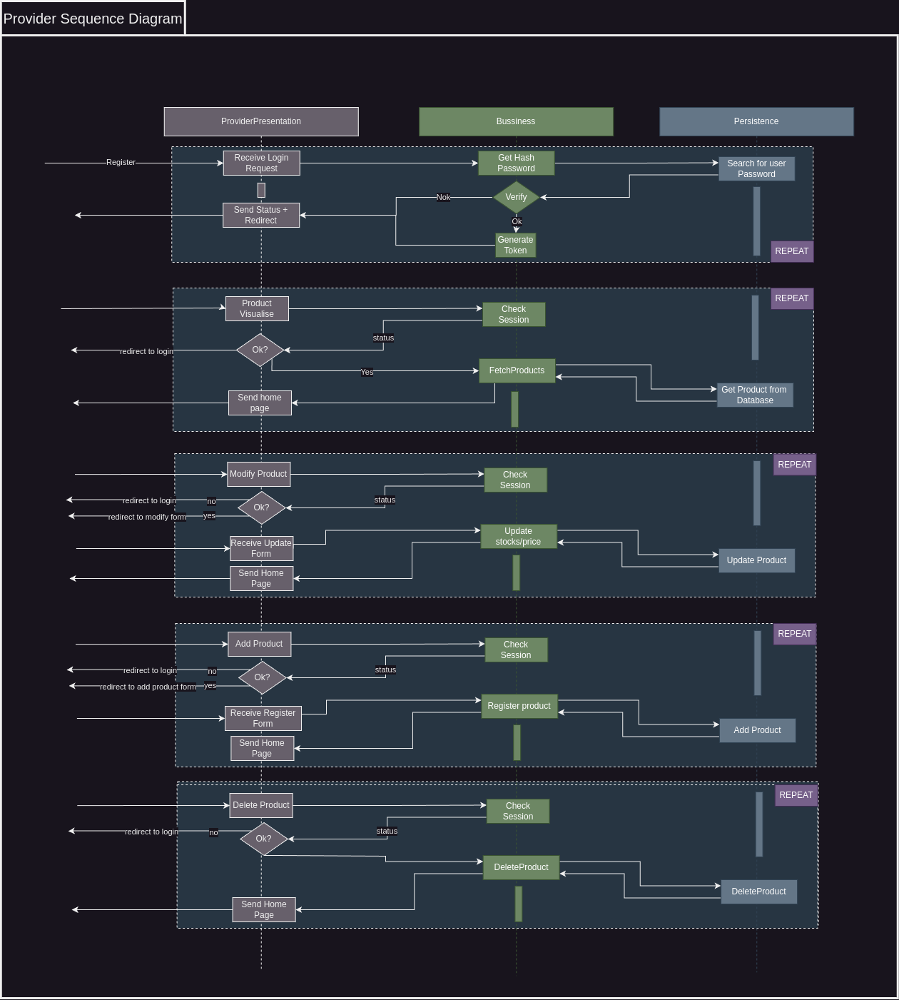

## Overview

1. [Purpose of this app](#1-purpose-of-this-app)
2. [Teamwork](#2-teamwork)
3. [Videos](#3-video-demo)
4. [Architecture](#4-architecture)
    1. [Use Cases](#i-use-cases)
    2. [Activities](#ii-activities)
    3. [Entities](#iii-entities)
    4. [Architecture Type](#iv-architecture-type)
    5. [Layers Interaction](#v-layers-interaction)
    6. [Components & Packages](#vi-components--packages)
    7. [Classes](#vii-classes)
5. [Strengths&Weaknesses](#viii-strengthsweaknesses)

## 1. Purpose of this app

- To implement a bookstore-like platform with the basic functions of a store.
- To design an architecture based on the analysis of the app specification without unnecessary overheads.
- To achieve complexity based on holistic simplicity: loose coupling, strong cohesion, and modularity.

## 2. Teamwork

[Damir Denis-Tudor](https://github.com/DamirDenis-Tudor)
- **Tasks:**
    - Designed the architecture.
    - Implemented the Business, Persistence, Integration, and Commons layers.

- **Gains:**
    - Learned C# and became familiar with .NET's Entity Framework.
    - Enhanced architectural system design and development skills.
    - Improved teamwork collaboration by effectively separating tasks and working towards integration.

[Asmarandei Catalin](https://github.com/PurpleFishh)
- **Tasks**:
  - Implemented the front-end
  - Designed the application([Figma design](https://www.figma.com/design/ThCjKdA5YnxzdEOn9uVDaC/PetShopIP-Test-Colors-3?node-id=0-1&t=PwkajT92CHuHtitr-1))
- **Gains**:
  - Learned C# and .NET Blazor
  - Enhanced my front-end and design skills by developing a fully functional application
  - Improved my ability to work in a team setting by effectively separating tasks and working towards integration

## 3. Video Demo

---

## 4. Architecture

### I. Use Cases

- We need to accommodate three separate use cases. Each user type will have its own UI.

### II. Activities

- Based on these use cases, we must define each flow that a user type can accomplish.

| Admin Activity Diagram                                           | Client Activity Diagram                                            | Provider Activity Diagram                                              |
|------------------------------------------------------------------|--------------------------------------------------------------------|------------------------------------------------------------------------|
|  |  |  |

### III. Entities

- As we moved further, we identified the required entities as follows:

### IV. Architecture Type

- Based on previous analysis, we identified that a layered pattern will fit our application specifics.
- About the layers:
    - Presentation is split into three separate parts (see the use cases) + common layer.
    - Business includes a series of services for authentication, privacy, etc. Additionally, it defines a series of BTOs
      meant for presentation-related logic.
    - Persistence contains a series of repositories that encapsulate CRUD operations for each entity. Furthermore, it
      defines a series of DTOs meant for business/presentation-related data flow.
    - Commons contain various general-purpose utilities like a scoped logger and a generic implementation of a result
      pattern.
    - Integration includes unit tests of the persistence and business layers as well as database seeding.

### V. Layers Interaction

- Now that we have split our app into distinct functionalities, it's time to define the logical interaction between
  layers.

| Admin Sequence Diagram                                           | Client Sequence Diagram                                            | Provider Sequence Diagram                                              |
|------------------------------------------------------------------|--------------------------------------------------------------------|------------------------------------------------------------------------|
|  |  |  |

### VI. Components & Packages
- As we advanced in our design we can now define rigorously the boundaries of the modules by providing a series of interfaces/transfer objects to the higher modules:

### VII. Classes

- One of the primary design aspects was to ensure well-defined boundaries. The following class diagram supports that:

### VIII. Strengths&Weaknesses

### Strengths
- **Minimalistic and Effective Frontend:** The user interface is simple yet efficient, providing a good user experience.
- **Cross Site Scripting:** Html sanitization of inputs implemented.
- **GDPR Compliance:** User data protection regulations are respected, ensuring privacy and security.
- **User Access Rights:** Different types of user access rights are implemented to maintain security and appropriate access control.
- **Monolithic Design Approach:** The application follows a well-defined monolithic design approach with clear layer boundaries.
- **Entity Relationships:** Entities and their relationships are well-defined, ensuring a robust and scalable architecture.

### Weaknesses
- **Session-Based Authentication:**
    - The authentication system is session-based, with tokens stored in local storage.
    - If someone gains access to the local storage within the session time (e.g., 5 minutes), they can potentially change the user's password.
    - **Solution:** Personal details updates should require password confirmation.
- **Encryption:** Encryption is based on the password hash, which may need enhancement for better security.
- **Password Update:** Updating the password requires encryption of user-related information.
- **Order Cart Storage:** The order cart is stored in local storage, which might need to be reconsidered for security reasons.
- **Use Case Analysis:** The Shipper use case should be further analyzed for improvements.
